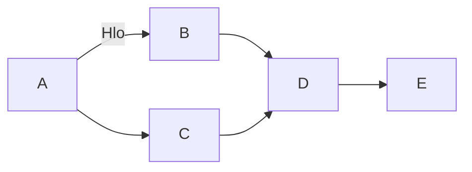
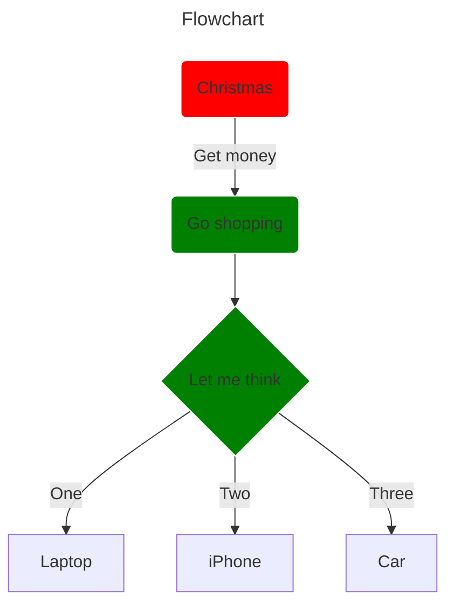
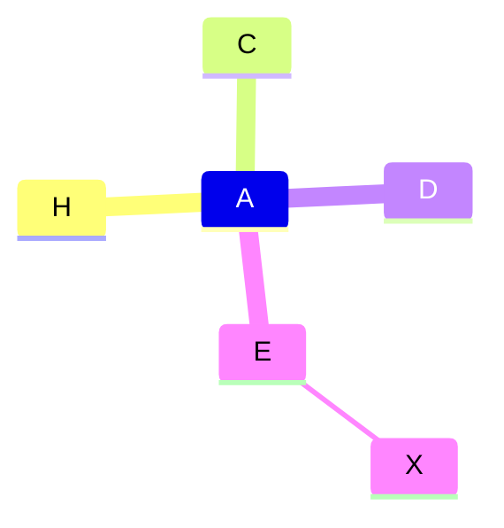
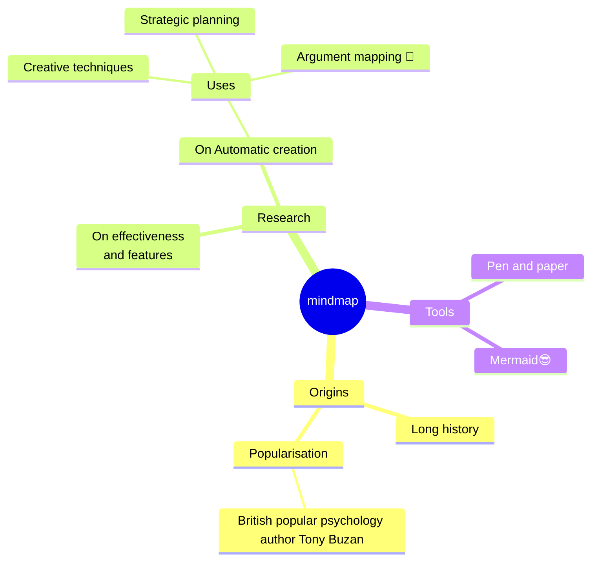
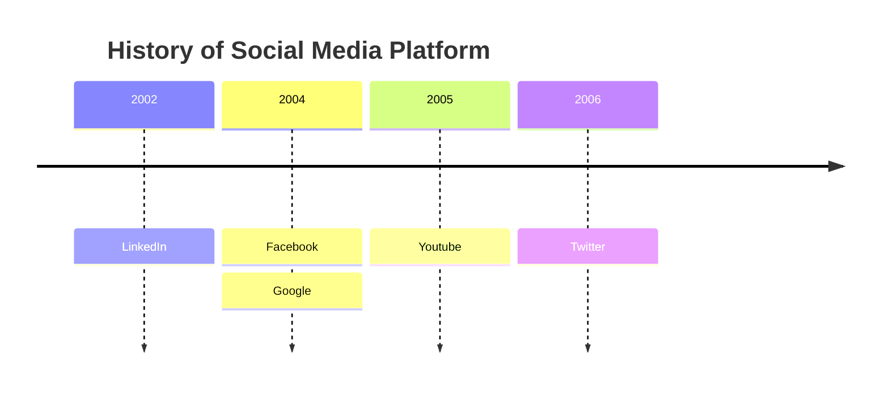
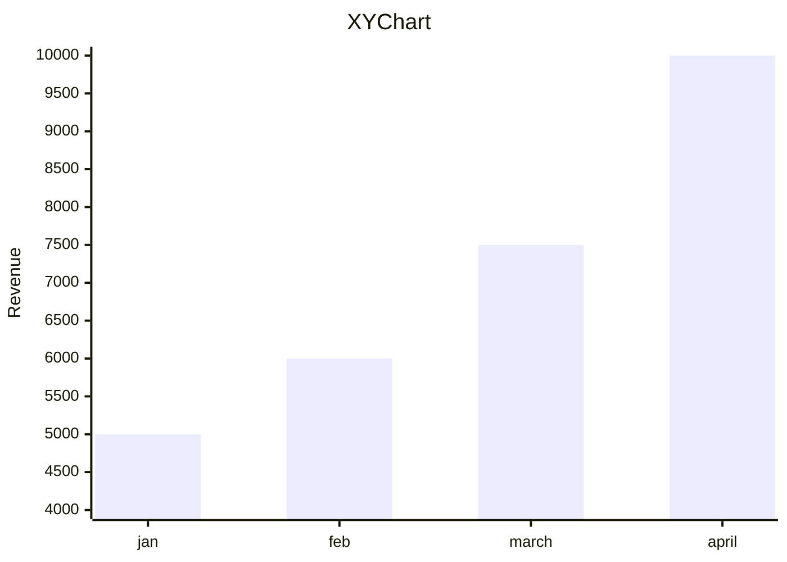

#Mermaid

``` mermaid
flowchart LR
    A-- Hlo -->B
    A-->C
    B-->D
    C-->D
    D-->E 
```

```mermaid
---
title: Flowchart
---
flowchart TD
    A(Christmas)-- Get money -->B(Go shopping)
    B --> C{Let me think}
    C --One --> D[Laptop] 
    C --Two -->E[iPhone]
    C --Three --> F[Car]
    style A fill:red,stroke:white
    style B fill:green,stroke:white
    style C fill:green,stroke:white
```

``` mermaid
pie 
    showData
    title Pie Chart
    "Words" : 7
    "Voice Tone" : 38
    "Body Language" : 55
%%{init: { 'themeVariables': { 'pie1': 'red, 'pie2': yellow, 'pie3': blue}}}%%
```

``` mermaid
mindmap
        A
            H
            ::icon(fa fa-book)
            C
            D
            E
                X
```

``` mermaid
mindmap
  root((mindmap))
    Origins
      Long history
      ::icon(fa fa-book)
      Popularisation
        British popular psychology author Tony Buzan
    Research
      On effectiveness<br/>and features
      On Automatic creation
        Uses
            Creative techniques
            Strategic planning
            Argument mapping 👤
    Tools
      Pen and paper
      Mermaid😎
```

```mermaid
timeline
    title History of Social Media Platform
    2002 : LinkedIn
    2004 : Facebook
         : Google
    2005 : Youtube
    2006 : Twitter
```

```mermaid
xychart-beta
    title XY Chart
    x-axis [jan,feb,march,april]
    y-axis "Revenue" 4000 --> 10000
    bar [5000, 6000, 7500, 10000]
```
