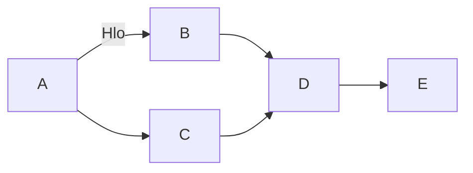
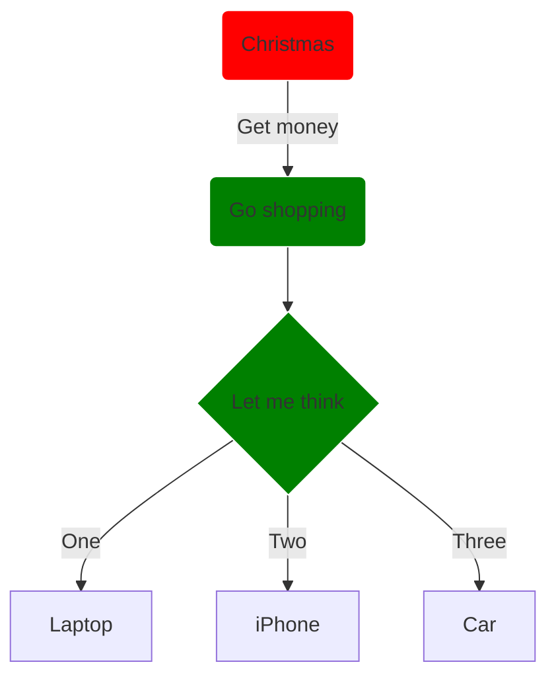
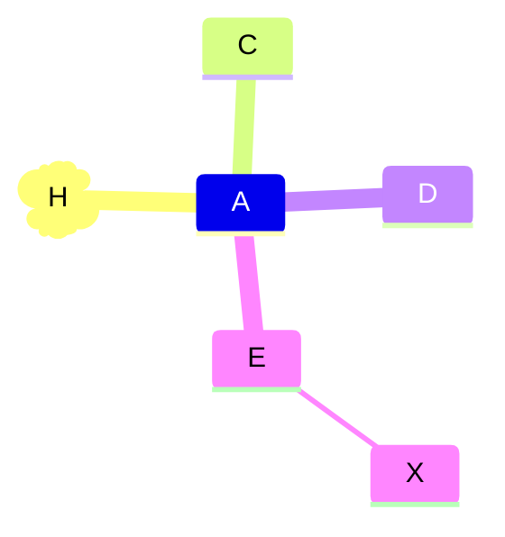
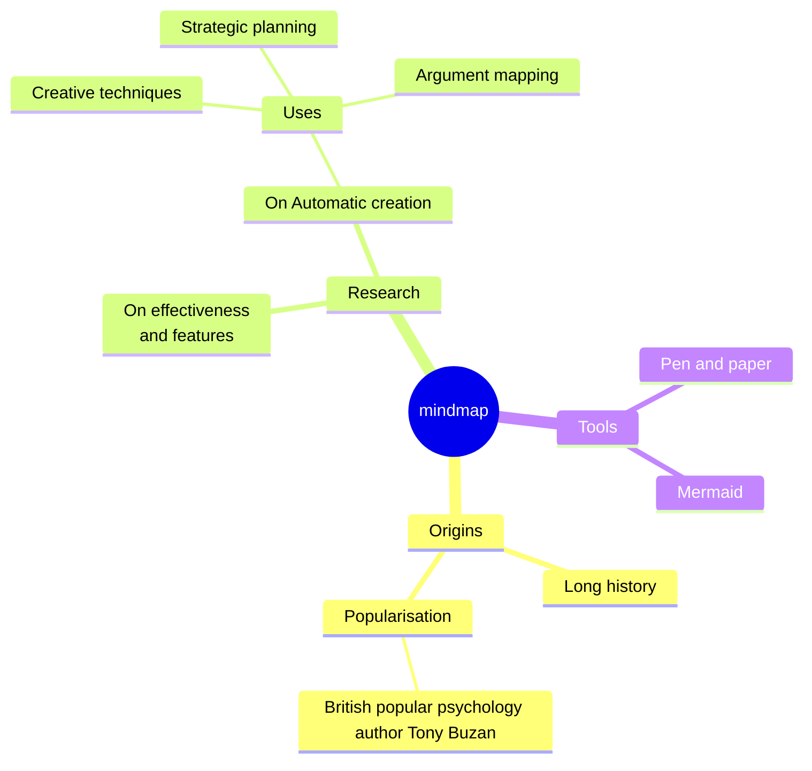

#Mermaid

``` mermaid
flowchart LR
    A-- Hlo -->B
    A-->C
    B-->D
    C-->D
    D-->E 
```

```mermaid
flowchart TD
    A(Christmas)-- Get money -->B(Go shopping)
    B --> C{Let me think}
    C --One --> D[Laptop] 
    C --Two -->E[iPhone]
    C --Three --> F[Car]
    style A fill:red,stroke:white
    style B fill:green,stroke:white
    style C fill:green,stroke:white
```

``` mermaid
pie 
    showData
    title Pie Chart
    "Words" : 7
    "Voice Tone" : 38
    "Body Language" : 55
%%{init: {'theme': 'base', 'themeVariables': { 'pie1': '#FFFFFF', 'pie2': '#FFFF00', 'pie3': '#00FF00'}}}%%
```

``` mermaid
mindmap
        A
            id)H(
            ::icon(fa fa-book)
            C
            D
            E
                X
```

``` mermaid
mindmap
  root((mindmap))
    Origins
      Long history
      ::icon(fa fa-book)
      Popularisation
        British popular psychology author Tony Buzan
    Research
      On effectiveness<br/>and features
      On Automatic creation
        Uses
            Creative techniques
            Strategic planning
            Argument mapping
    Tools
      Pen and paper
      Mermaid
```

        
