# Mermaid

## Flow Chart Left to Right

**Sample Code**
````
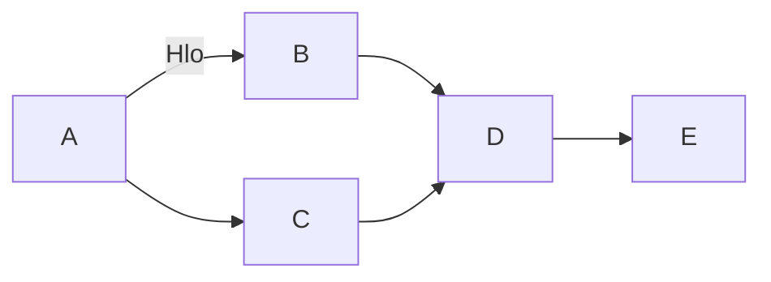
````

**Output**

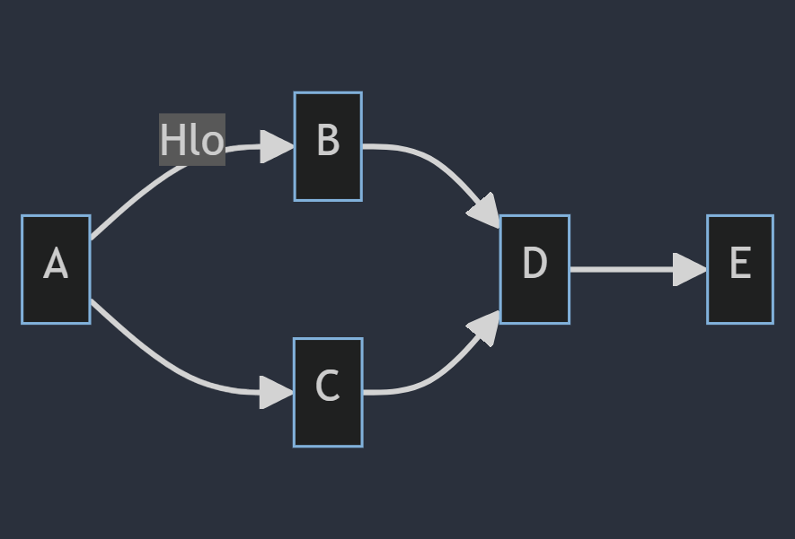

## Flow Chart Top to Bottom

**Sample Code**

````
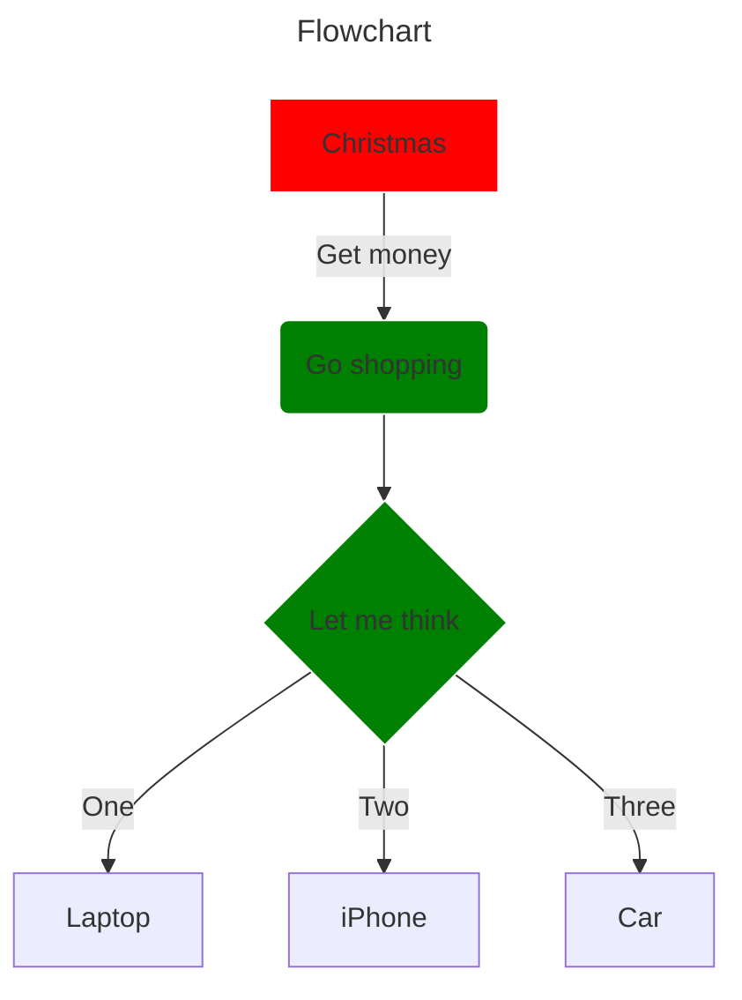
````

**Output**

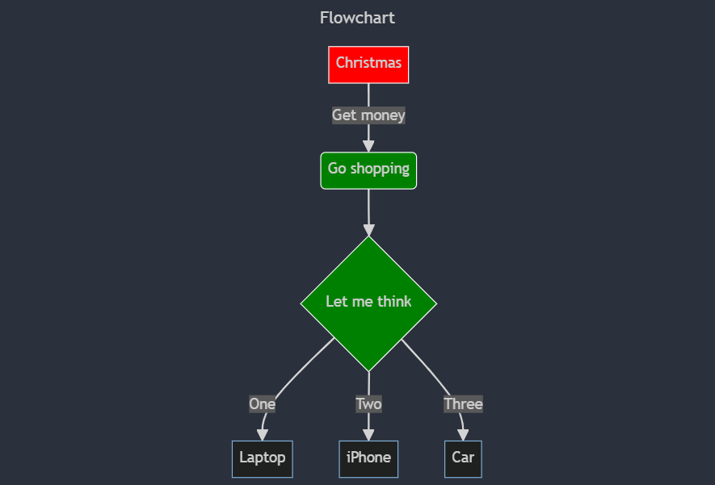

## Pie Chart

**Sample Code**

````
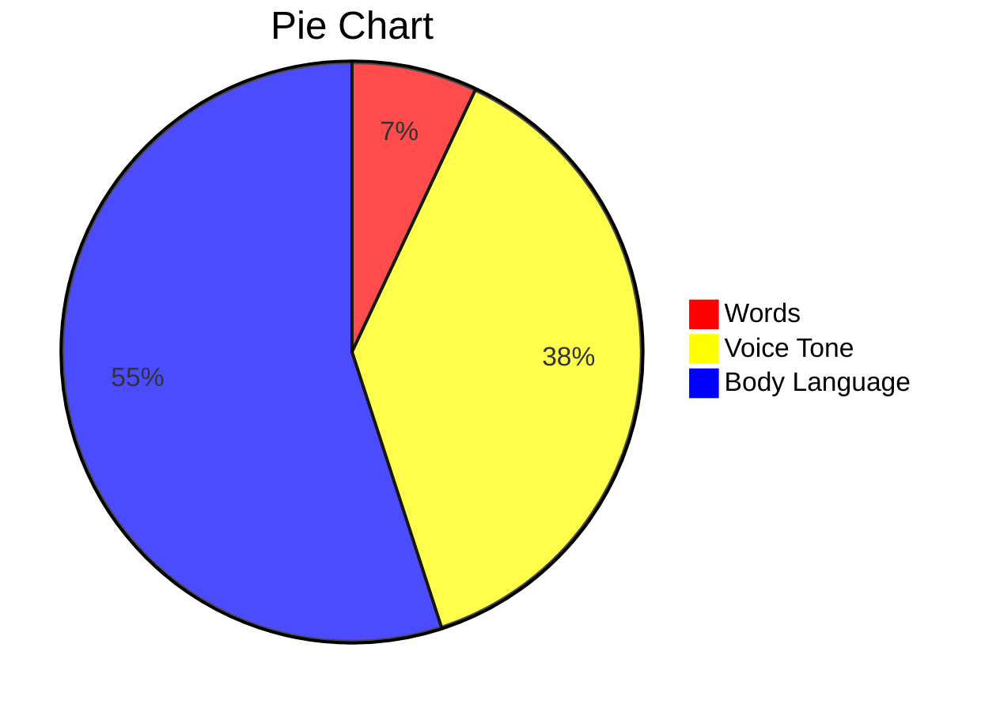
````

**Output**

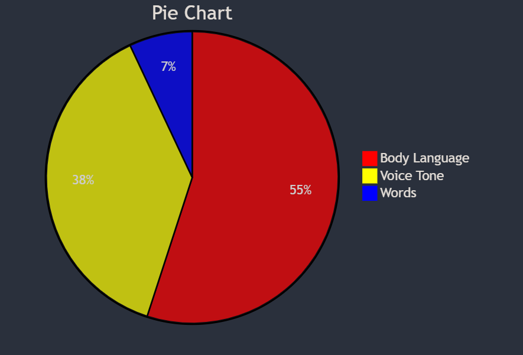

## Mindmap

**Sample Code**

````
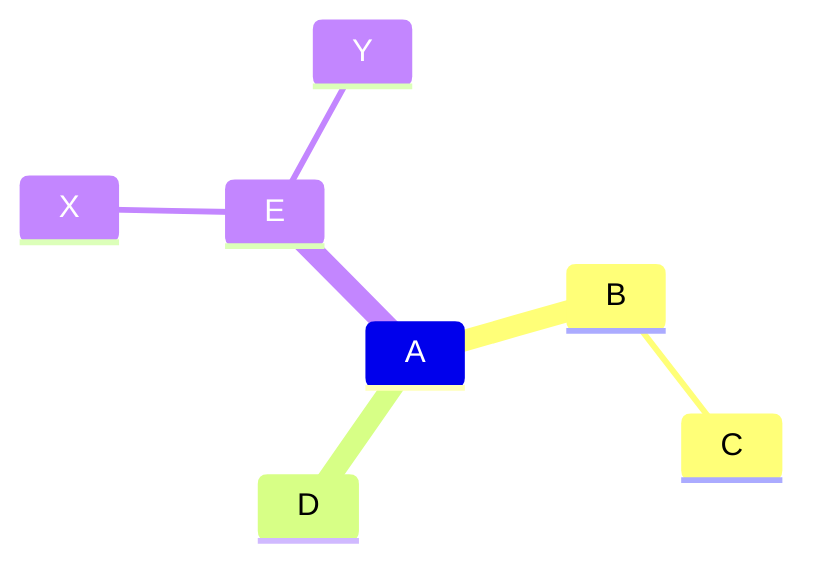
````

**Output**

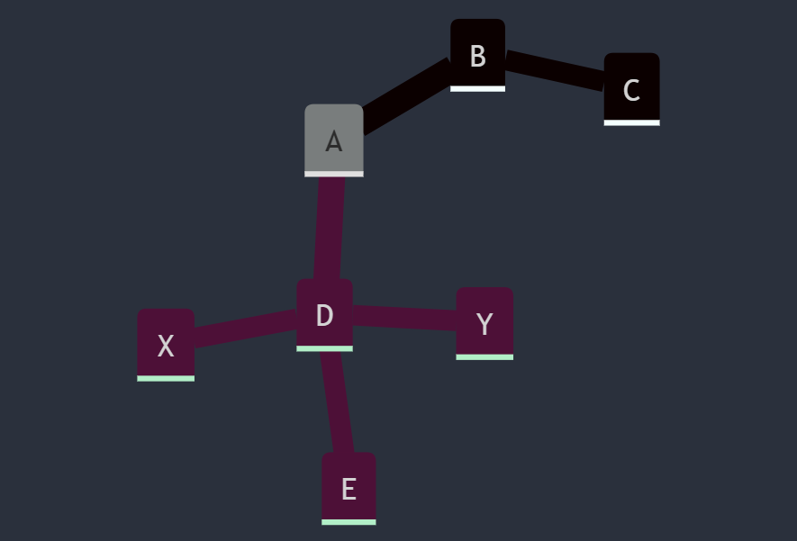

## Mindmap

**Sample Code**

````
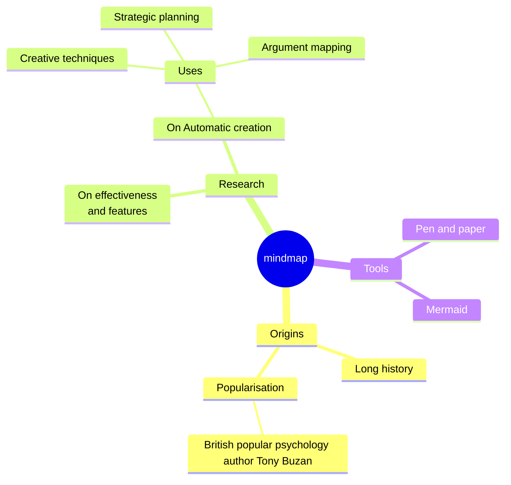
````

**Output**

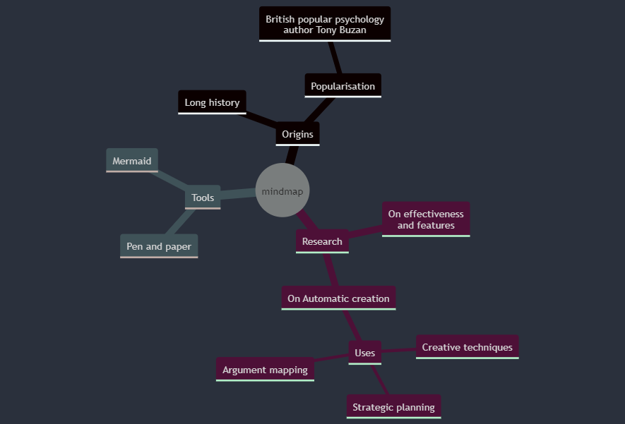

## Timeline

**Sample Code**

````
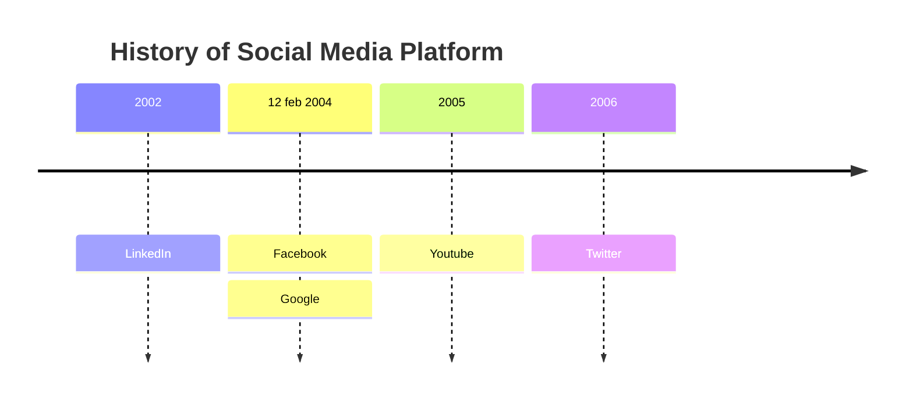
````

**Output**

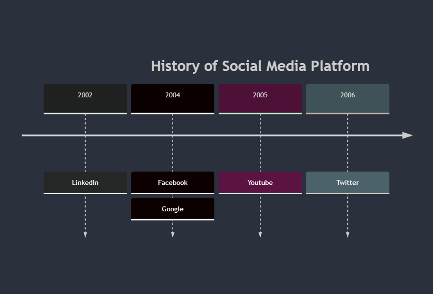

## XY Chart 

**Sample Code**

````
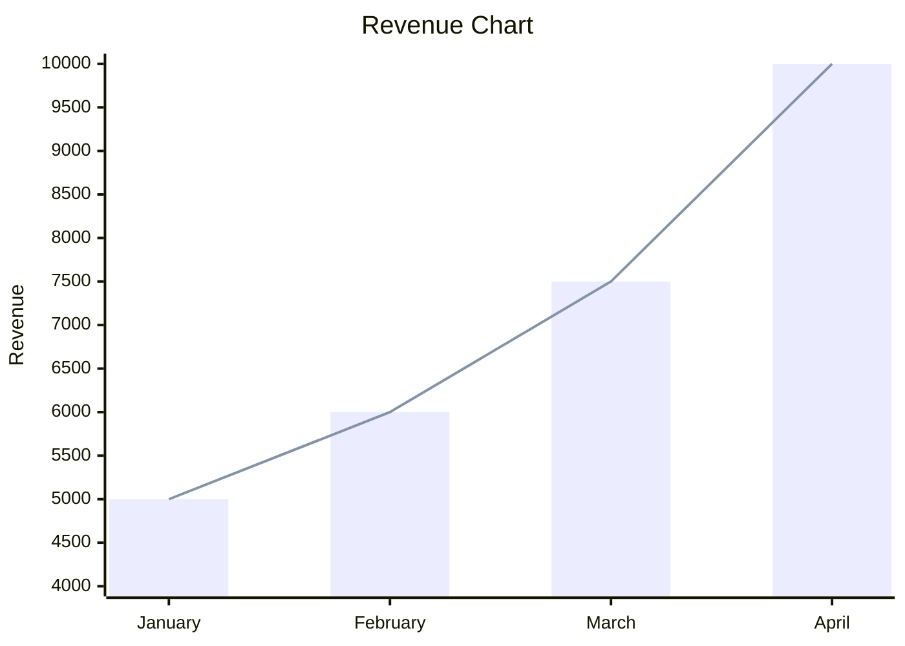
````

**Output**

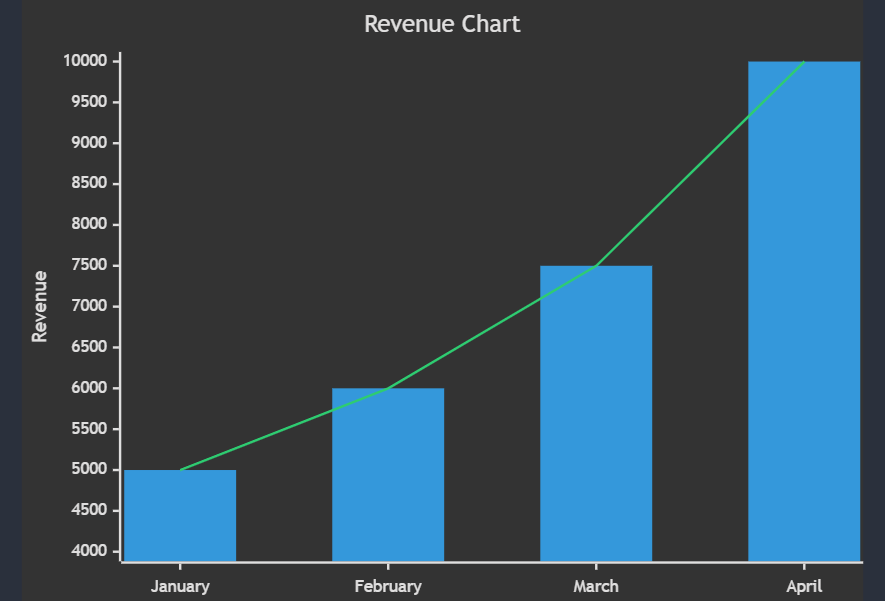

**Note: The given syntax is for Github only. In live editor, don't use ```` ```mermaid ``` ````. Just type the code directly.**

