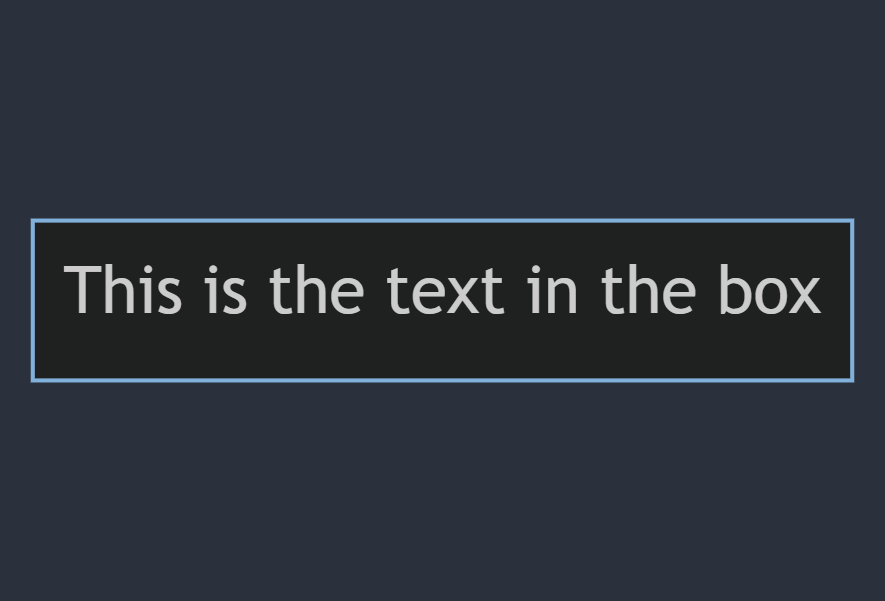
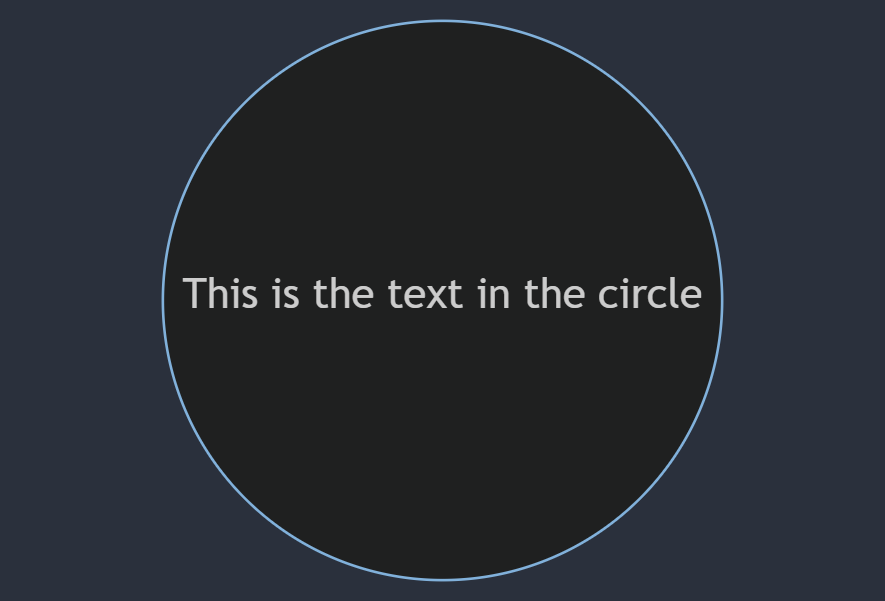

# Shapes

## Node 
**Sample Code**

```
id1[This is the text in the box]
```

**Output**



## Node with Rounded Edges

**Sample Code**

```
id1(This is the text in the box)
```

**Output**


## Node in form of Circle

**Sample Code**

```
id1((This is the text in the circle))
```

**Output**



**Note: To include Markdown Text in a Node, enclose the text in Double Quotes (") and backticks**

**Sample Code**

```
id1["`This is the **Markdown Text** in the box`"]
```

**Output**


